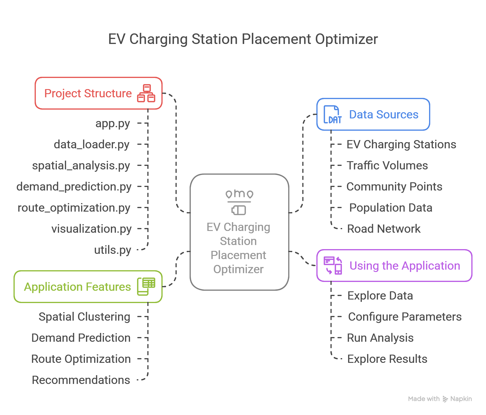

# EV Charging Station Placement Optimizer

This application uses spatial data mining techniques to identify optimal locations for new electric vehicle (EV) charging stations in Calgary. By analyzing traffic patterns, demographics, and existing infrastructure, it provides data-driven recommendations for EV charging station placement.

## Project Visual Walkthrough


## Project Structure

```
ev_charging_optimizer/
├── app.py                 # Main application file
├── data_loader.py         # Data loading and processing functions
├── spatial_analysis.py    # Clustering and spatial analysis
├── demand_prediction.py   # Demand prediction models
├── route_optimization.py  # Route optimization algorithms
├── visualization.py       # Mapping and chart functions
├── utils.py              # Utility functions
├── requirements.txt       # Project dependencies
└── data/                  # Directory for data files
    ├── calgary_ev_stations.csv
    ├── Traffic_Volumes_for_2023.csv
    ├── Community_Points_20250414.csv
    ├── calgary population dataset.csv
    └── Major_Road_Network_2025.csv
```
## Prerequisites

- Python 3.8 or higher
- pip package manager
- VS Code (recommended for development)

## Installation

1. Clone the repository:
   ```
   git clone <repository-url>
   cd ev_charging_optimizer
   ```

2. Create a virtual environment (optional but recommended):
   ```
   python -m venv venv
   ```

3. Activate the virtual environment:
   - On Windows:
     ```
     venv\Scripts\activate
     ```
   - On macOS/Linux:
     ```
     source venv/bin/activate
     ```

4. Install the required packages:
   ```
   pip install -r requirements.txt
   ```

5. Set up the data directory:
   ```
   mkdir -p data
   ```

6. Place your data files in the `data/` directory:
   - calgary_ev_stations.csv
   - Traffic_Volumes_for_2023.csv
   - Community_Points_20250414.csv
   - calgary population dataset.csv
   - Major_Road_Network_2025.csv

## Running the Application

1. Start the Streamlit app:
   ```
   streamlit run app.py
   ```

2. Open your web browser and navigate to the URL displayed in the terminal (typically http://localhost:8501).

## Using the Application

1. **Explore Data**: Navigate through the Data Explorer tab to understand the current infrastructure.
2. **Configure Parameters**: Adjust clustering algorithm, forecast period, and optimization settings in the sidebar.
3. **Run Analysis**: Click the "Run Analysis" button to generate results.
4. **Explore Results**: Navigate through the tabs to view different aspects of the analysis.

## Application Features

- **Spatial Clustering**: Identifies high-potential areas for charging stations
- **Demand Prediction**: Forecasts future EV charging demand
- **Route Optimization**: Optimizes routes between high-demand locations
- **Recommendations**: Provides ranked list of suggested locations for new charging stations

## Data Sources

The application uses the following datasets from the City of Calgary Open Data Portal:
- EV charging stations
- Traffic volumes
- Community points
- Population data
- Road network

## Development in VS Code

For development in VS Code:

1. Open the project folder in VS Code:
   ```
   code .
   ```

2. Select the Python interpreter from your virtual environment:
   - Press `Ctrl+Shift+P` (or `Cmd+Shift+P` on macOS)
   - Type "Python: Select Interpreter" and select the one from your virtual environment

3. Install recommended extensions:
   - Python
   - Pylance
   - Jupyter

4. To run the application from VS Code:
   - Open a terminal in VS Code (`Ctrl+``)
   - Activate your virtual environment if it's not already activated
   - Run `streamlit run app.py`

## Customization

- Modify clustering parameters in the sidebar to adjust sensitivity
- Change forecast period to see different future projections
- Select different routing algorithms for route optimization

## Team

- [@AmreshSharma01](https://github.com/AmreshSharma01) - Amresh Sharma (Led the project, built the demand model with income integration, developed octant analysis, and wrote core paper sections.)
- [@NishathRuksana](https://github.com/NishathRuksana) - Nishath Ruksana (Implemented clustering, spatial analysis, and dashboard visuals; wrote background and implementation.)
- [@Ujjal-Baniya](https://github.com/Ujjal-Baniya) - Ujjal Baniya (Developed route optimization and dashboard; handled results analysis and documentation.)